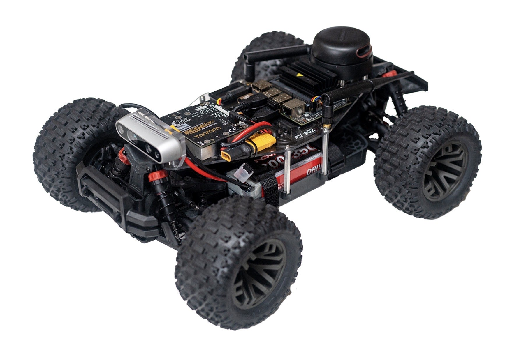
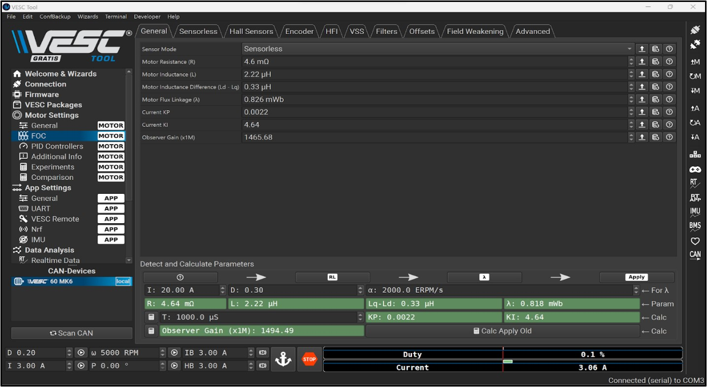
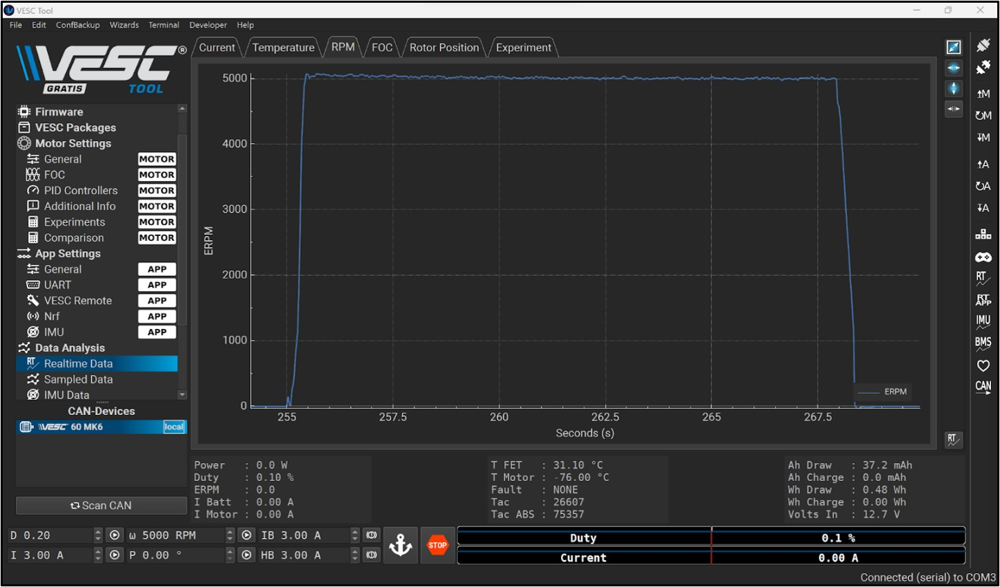
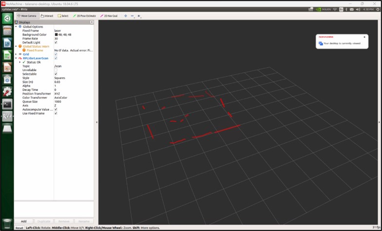
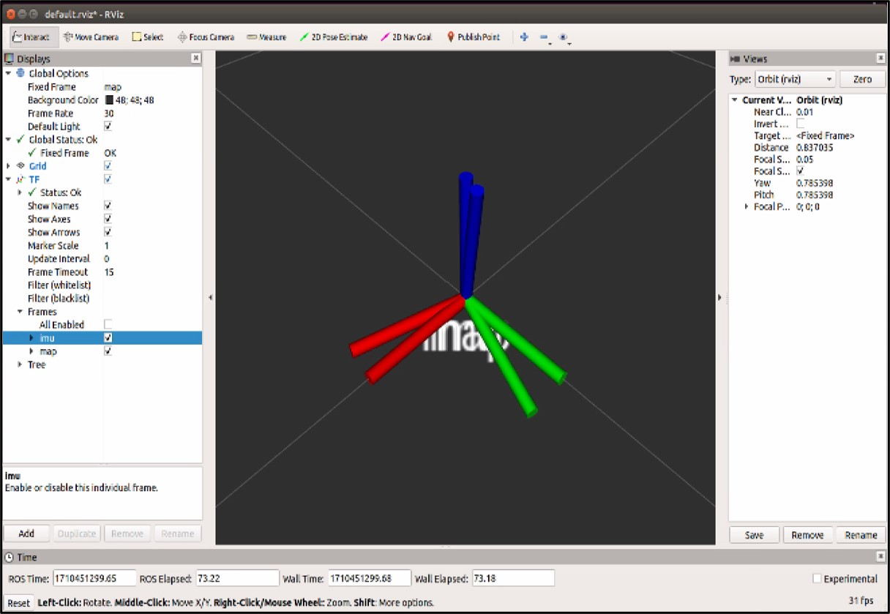
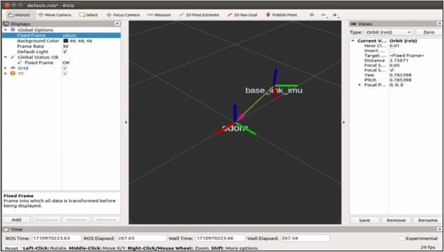
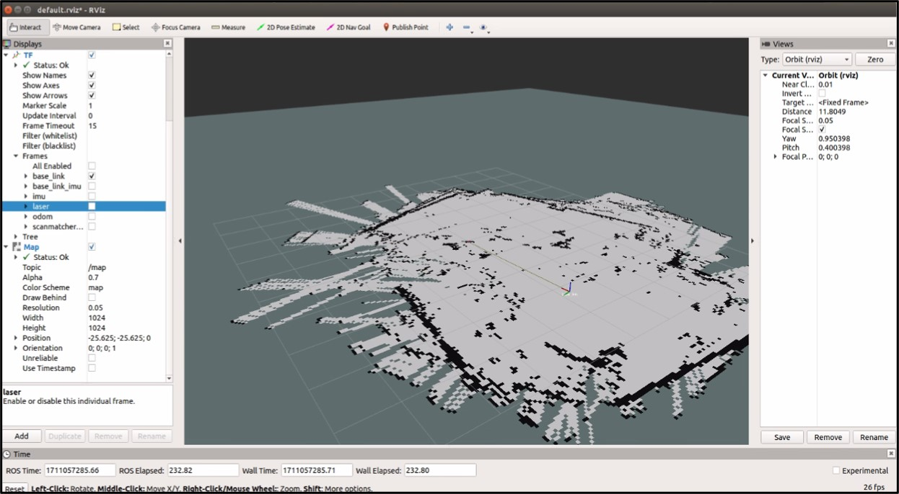
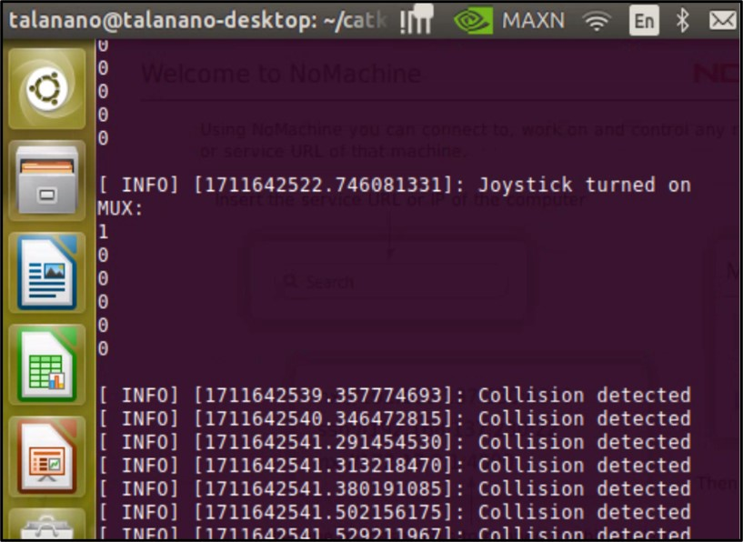
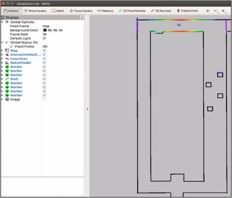
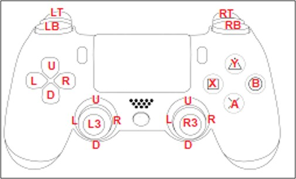

# AEV Autonomous Navigation System
 
McMaster ELECENG 3EY4, Jan 2024 – Apr 2025.
 
Scale model autonomous electric vehicle (AEV) that uses LiDAR, inertial, and wheel odometry data to localize itself in real time, and runs both driver-assist collision avoidance and fully autonomous navigation along with localization.
 
`Python` `C/C++` `ROS` `Linux` `MATLAB` `Simulink` `IMU` `SLAM` `Nvidia Jetson Nano` `LiDAR` `RGB-D Camera` `VESC Motor Controller`

<p align="center">
<br>
<em>Assembled AEV with the Jetson Nano, VESC, LiDAR Scanner, IMU, and Depth Camera Mounted.</em>
</p>

---

## Table of Contents
- [Overview](#overview)
- [Hardware & Software](#hardware--software)
- [System Architecture](#system-architecture)
- [Core Components](#core-components)
  - [1. Motor Control & Calibration](#1-motor-control--calibration)
  - [2. Localization](#2-localization)
  - [3. Driver-Assist Collision Avoidance](#3-driver-assist-collision-avoidance)
  - [4. Autonomous Navigation](#4-autonomous-navigation)
- [Running the System](#running-the-system)
- [Results](#results)
- [Full Reports](#full-reports)

---

## Overview

The AEV Autonomous Navigation System is a scale model self-driving vehicle built to combine embedded electronics, sensing, and control software into a working autonomous platform. A Nvidia Jetson Nano running ROS coordinates a VESC motor controller with brushless DC drive and servo steering, a LiDAR laser scanner, an inertial measurement unit (IMU), a depth camera, and a joystick for manual driving. Wheel odometry, IMU orientation, and LiDAR based scan matching are combined to localize the vehicle, and that localization is used for both a driver assist collision avoidance mode and a fully autonomous mode that can wall follow, avoid obstacles, and reverse itself out of dead ends.

---

## Hardware & Software

### Hardware

| Component | Purpose |
|---|---|
| Nvidia Jetson Nano | Embedded computer running ROS, coordinating the motor controller, sensors, and control algorithms |
| VESC Motor Controller | Drives the brushless DC motor and servo steering based on speed and steering commands from ROS |
| LiDAR Laser Scanner | Provides 360 degree range data used for localization, collision avoidance, and navigation |
| Bosch BNO055 Inertial Measurement Unit (IMU) | Provides orientation data (accelerometer, gyroscope, and magnetometer) used to correct wheel odometry drift |
| Intel RealSense Depth Camera | Provides colour and depth image data of the vehicle's surroundings |
| Logitech F710 Joystick | Provides manual driving input and toggles between manual, driver assist, and autonomous modes |

### Software

| Tool / Library | Purpose |
|---|---|
| ROS | Core framework coordinating all nodes for sensing, localization, and control |
| Python | Collision avoidance, wall following, and gap finding navigation nodes |
| C/C++ | VESC driver modifications, odometry node, and static transform publishers |
| MATLAB / Simulink | Supporting analysis of motor parameters and control response |
| Linux (Ubuntu) | Operating system on the Jetson Nano, including udev rule setup for consistent device recognition |
| hector_slam | SLAM package used to check localization accuracy |
| laser_scan_matcher | Scan matching package used to refine the pose estimate between consecutive LiDAR scans |
| quadprog | Python quadratic programming solver used to compute virtual line barriers for navigation |

---

## System Architecture

| Stage | Hardware | Output |
|---|---|---|
| Sensing | LiDAR scanner, IMU, depth camera | Range scans, orientation data, colour/depth images |
| Motor Control | Jetson Nano (ROS) -> VESC | Calibrated speed (ERPM) and steering (servo) commands |
| Localization | Wheel odometry, IMU, LiDAR scan matching | Vehicle pose estimate (`odom` to `base_link` transform) |
| Driver-Assist | Joystick input and LiDAR based potential field | Corrected velocity and steering commands |
| Autonomous Navigation | LiDAR based gap finding/quadratic optimization | Autonomous velocity and steering commands |

All nodes communicate over ROS topics, with coordinate frames (`base_link`, `laser`, `imu`, `camera`, `odom`, `map`) related through static and dynamic transforms.

---

## Core Components

### 1. Motor Control & Calibration

- The VESC's field oriented control (FOC) identification process gave us the motor's electrical parameters (resistance, inductance, flux linkage), which set the current control loop gains, and the PID speed controller gains were tuned by hand for smooth, stable speed response.
- The relationship between commanded velocity/steering angle and actual vehicle motion was worked out using a racecar simulator and bicycle model kinematics, converting Ackermann drive commands into VESC speed (ERPM) and servo commands.
- A calibration experiment related the vehicle's physical turning radius to its commanded steering angle, giving a steering angle to servo gain that we used for the rest of the project.
- We used the d- and q-axis current relationship to check motor behaviour, since q-axis current is proportional to motor torque. This let us see forward, stop, and reverse behaviour, including regenerative braking, from live current data.

<p align="center">
<br>
<em>VESC Tool FOC General Tab After the Motor Identification Process, from Lab 4.</em>
</p>

<p align="center">
<br>
<em>VESC Tool RPM Graph from Speed Testing, from Lab 4.</em>
</p>

### 2. Localization

- Static transforms were worked out and published between `base_link` and the `laser`, `imu`, and `camera` frames, based on where each sensor was physically mounted.
- The IMU was calibrated (accelerometer, gyroscope, magnetometer) and its orientation output was checked against the East North Up convention before being used for localization.
- Discrete time wheel odometry was implemented from the vehicle's speed and steering angle, integrating the bicycle model kinematics to estimate position and heading over time.
- Wheel odometry's integrated yaw was swapped out for the IMU's yaw measurement to cut down on drift, which meant transforming between the IMU's Earth fixed frame and wheel odometry's vehicle fixed frame.
- LiDAR based scan matching (`laser_scan_matcher`) was added on top to further correct the pose estimate between consecutive scans, and `hector_slam` was used to build a map of the environment while localizing within it at the same time, confirming the localization pipeline was accurate to about 5cm.

<p align="center">
<br>
<em>RViz Point Cloud Map from the LiDAR, from Lab 3.</em>
</p>

<p align="center">


</p>
<p align="center"><em>Alignment of the "map" and "imu" Frames in RViz, and Drift Between the "odom" and "base_link" Frames After Driving the Vehicle, from Lab 7.</em></p>

<p align="center">
<br>
<em>Constructed Map Environment from hector_slam, from Lab 7.</em>
</p>

### 3. Driver-Assist Collision Avoidance

- A potential field method computes a repelling force from every LiDAR point within a set safe distance of the vehicle, and that force gets stronger the closer an obstacle gets.
- This corrective force is combined with the driver's joystick velocity and steering commands using tunable weighting parameters, so the driver keeps full control when far from obstacles, and the algorithm takes over more of the correction as a collision gets closer.
- If the vehicle gets close enough that a collision can't be avoided, the algorithm can override joystick input completely and bring the vehicle to a stop.
- This mode is toggled on the joystick, so the driver can switch between full manual driving and driver-assisted driving at any time.

<p align="center">
<br>
<em>Collision Avoidance Assistance Detecting and Halting a Collision, from Lab 8.</em>
</p>

### 4. Autonomous Navigation

- **Wall Following:** A feedback linearizing controller combined with a proportional derivative feedback law keeps the vehicle at a set distance from the walls on either side of a corridor, using LiDAR returns to work out the distance and angle to each wall. It can track the left wall, the right wall, or an offset from the centerline, depending on the mode selected.
- **Gap Finding:** LiDAR data is preprocessed within a defined field-of-view in front of the vehicle, and the longest run of consecutive obstacle free returns is picked out as the largest gap. The desired heading is a range weighted average across that gap instead of just its two endpoints, which gives a steadier direction of travel.
- **Optimization Based Barriers:** Two quadratic programming formulations were implemented to compute virtual separating line barriers from the LiDAR points on either side of the vehicle, either independently on each side or as a constrained parallel pair, so the vehicle can center itself in the widest open path ahead while smoothing the barrier position between time steps.
- **Dead-End Recovery:** A finite state machine switches the vehicle between normal driving, turning, and reversing. If the vehicle can't turn enough to avoid an obstacle, it automatically reverses away from it before trying to turn again, repeating until it can move forward.

<p align="center">
<br>
<em>Virtual Line Barrier Markers in the RViz Simulation, from Lab 9.</em>
</p>

---

## Running the System

The vehicle is operated from the Jetson Nano with all sensors connected and udev rules set up for consistent device naming:

```bash
roslaunch f1tenth_simulator experiment.launch
```

This launches the VESC driver, LiDAR driver, IMU driver, localization nodes, and the collision assistance and navigation nodes together. Joystick buttons toggle between modes during operation:

- **LT/left and right analog sticks:** Manual driving.
- **X:** Toggle driver-assist collision avoidance on or off.
- **RB:** Toggle fully autonomous navigation on or off.
- **LB:** Immediately return to full manual driving.

<p align="center">
<br>
<em>Visual Reference of the Buttons on the Joystick.</em>
</p>

---

## Results

- **Localization:** The wheel odometry, IMU, and LiDAR scan matching pipeline was accurate to about 5cm, which were checked against maps built with hector_slam.
- **Driver-Assist:** The collision avoidance algorithm consistently caught imminent collisions and corrected or stopped the vehicle in both the simulator and on the physical vehicle.
- **Wall Following:** The vehicle reliably held a set distance from the left wall, right wall, or corridor centerline, with zero steady-state tracking error for a constant distance command.
- **Autonomous Navigation:** Both optimization formulations successfully navigated the vehicle around obstacles. The independent barrier formulation worked better for turning, and the parallel barrier formulation worked better in wider, straighter hallways.

---

## Full Reports

[Read the Lab 2 Report: Jetson Nano and ROS Basics](Files/Lab_02_abdela74_ismait1_patem156.pdf)  

[Read the Lab 3 Report: udev Rules and Sensor Data](Files/Lab_03_abdela74_ismait1_patem156.pdf)  

[Read the Lab 4 Report: VESC Motor Parameters and PID Tuning](Files/Lab_04_abdela74_ismait1_patem156.pdf)  

[Read the Lab 5 Report: VESC Control with the Jetson Nano](Files/Lab_05_abdela74_ismait1_patem156.pdf)  

[Read the Lab 6 Report: F1TENTH Simulator and Vehicle Model](Files/Lab_06_abdela74_ismait1_patem156.pdf)  

[Read the Lab 7 Report: Localization and Mapping](Files/Lab_07_abdela74_ismait1_patem156.pdf)  

[Read the Lab 8 Report: Driver-Assist Collision Avoidance](Files/Lab_08_abdela74_ismait1_patem156.pdf)  

[Read the Lab 9 Report: Autonomous Driving with Virtual Barriers](Files/Lab_09_abdela74_ismait1_patem156.pdf)  
